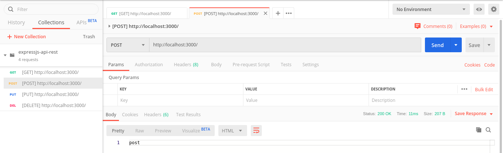

# API Rest em Express.js

__Install:__

    git clone https://github.com/flaviomicheletti/expressjs-api-rest
    npm install

__Run:__

    node app.js
    // Example app listening on port 3000!

__Testing:__

Use [Postman](https://www.getpostman.com/), export file `expressjs-api-rest.postman-collection.json`.

